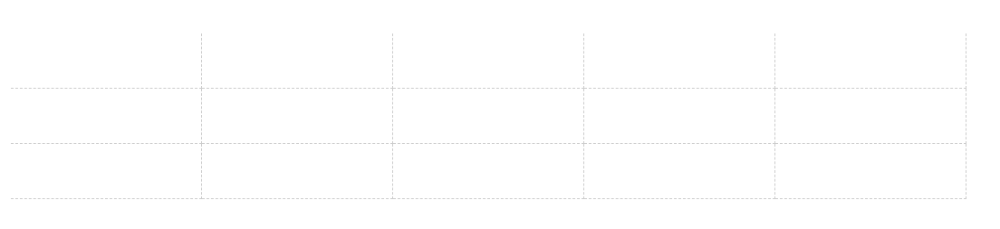

# 井字布局


上图所示的布局我称为井字布局，这样的布局很简单，用选择器把最右边和最下边的边框设置为0就可以，但还有一种方法值得记一下

这种布局的HTML用`li`就可以，每一个格子一个`li`，共15个

```html
<div class="wrapper">
  <div class="media-bd">
    <ul>
      <li></li>
      <li></li>
      <li></li>
      <li></li>
      <li></li>
      <li></li>
      <li></li>
      <li></li>
      <li></li>
      <li></li>
      <li></li>
      <li></li>
      <li></li>
      <li></li>
      <li></li>
    </ul>
  </div>
</div>
```

默认设置最外层`.wrapper`的宽度为`1055px`，布局的周边都没有边框，所以错误设置每个`li`的右边和下边有边框

```css
.wrapper {
    width: 1055px;
}
.media-bd li {
    float: left;
    width: 210px;
    height: 60px;
    border-right: 1px dashed #ccc;
    border-bottom: 1px dashed #ccc;
}
```

此时效果如下：



这个解决方法是使用`overflow`**溢出隐藏**，设置外层的宽度和高度小于这个布局的宽度和高度`1px`，就可以隐藏最右和最下的边框

那么设置`ul`的宽度

```css
.media-bd ul {
    width: 1054px;
    overflow: hidden;
}
```

这样的结果如下：


因为`ul`的宽度不够，所以`li`移向下一层。

那么可以设置`.media-bd`的宽高小于布局的宽高，而`ul`的宽高大于布局的宽高

所以最终代码如下：

```css
.media-bd {
  width: 1054px;
  height: 182px;
  overflow: hidden;
}
.media-bd ul {
  width: 1055px;
}
.media-bd li {
  float: left;
  width: 210px;
  height: 60px;
  border-right: 1px dashed #ccc;
  border-bottom: 1px dashed #ccc;
}
```

