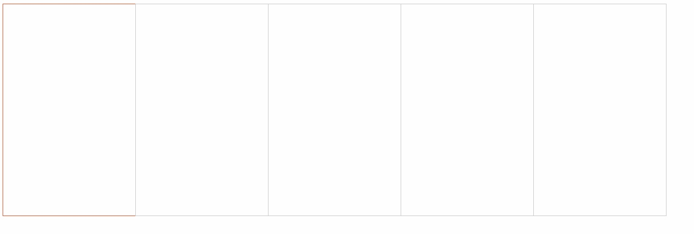
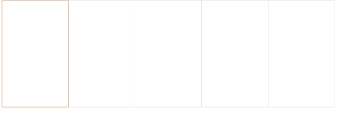

# README

在布局中，如果5个有边框的盒子相邻在同一行，那么相邻的边框相加会使相邻的边框变粗，如下图所示


此时的代码是这样的

有5个`div`


```html
<div></div>
<div></div>
<div></div>
<div></div>
<div></div>
```

css

```css
div {
    width: 250px;
    height: 400px;
    border: 1px solid #ccc;
    float: left;
}
```

此时边框的宽度为1，如果两个边框相邻，那么宽度就会变成2，怎么让相邻边框的宽度也是1呢？

可以用`margin-left: -1px;`，使每个盒子向左移动`1px`，那么此时有这样的疑惑，每个盒子向左移动`1px`，不就相当于没移动嘛，别忘了此时的盒子是向左浮动的，第一个盒子向左移动`1px`后，第二个盒子会因为浮动向左移动`1px`

```css
div {
    width: 250px;
    height: 400px;
    border: 1px solid #ccc;
    float: left;
    margin-left: -1px;
}
```

效果如下：


可以看出中间的线比上图细了一点

现在，添加当鼠标移动到盒子上时，边框颜色变化的样式

```css
div:hover {
	border: 1px solid #f40;
}
```



只显示了3个边框，那么用`z-index`提高盒子的层级呢？不行，因为只有盒子是相对定位、绝对定位、固定定位时才有此属性，这时可以用相对定位`relative`，因为相对定位比标准流高一级，是浮在标准流上面的

```css
div:hover {
	border: 1px solid #f40;
    position: relative;
}
```



有的时候可能需要`div`本身相对定位，那么只需要设置`div：hover{z-index: 1}`即可

```css
div {
      width: 250px;
      height: 400px;
      border: 1px solid #ccc;
      float: left;
      margin-left: -1px;
      position: relative;
    }
    div:hover {
      border: 1px solid #f40;
      z-index: 1;
    }
```

